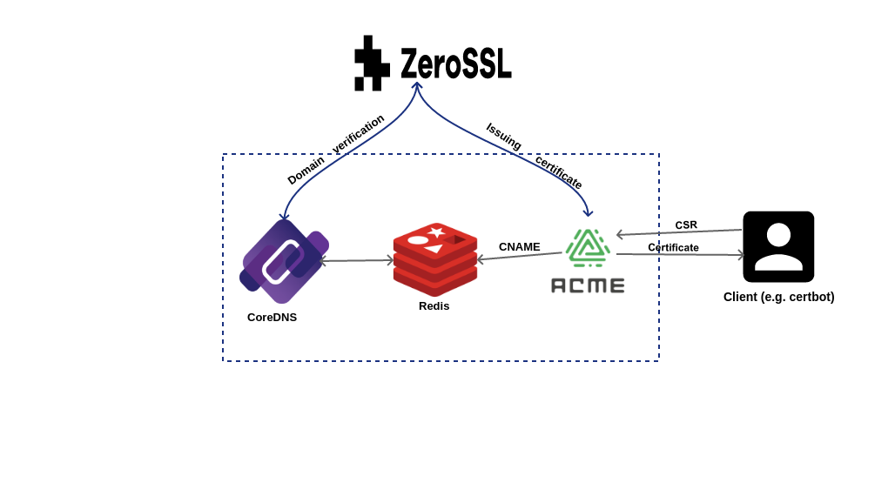

# tf-acmeserver
- [tf-acmeserver](#tf-acmeserver)
  - [Setup](#setup)
    - [Configuration](#configuration)
  - [Installation](#installation)
  - [Running the development server](#running-the-development-server)
  - [Configuring the server](#configuring-the-server)
  - [Building and configuration of CoreDNS](#building-and-configuration-of-coredns)
  - [Deployment](#deployment)
    - [Django settings](#django-settings)
    - [Gunicorn and nginx](#gunicorn-and-nginx)
    - [Docker](#docker)
  - [Testing with certbot (client)](#testing-with-certbot-client)
  - [What's different from acme2certifier?](#whats-different-from-acme2certifier)
    - [List of changes](#list-of-changes)


ACME to ZeroSSL.com REST API, based on [acme2certifier](https://github.com/grindsa/acme2certifier).

This server will enable normal ACME clients to issue certificates from non-acme servers, the main goal is to issue certificates from ZeroSSL (via REST API) for normal ACME clients. This will enable us to have ZeroSSL account key under one place, instead of distributing it to all clients.

## Setup

Because ACME and ZeroSSL.com require domain verification, a custom setup need to be set with a name server (CoreDNS or name.com API).



Certificates will be issued for sub-domains under a configured main domain, A [CA handler](https://github.com/grindsa/acme2certifier/blob/master/docs/ca_handler.md) is implemented for `acme2certifier` in [zerossl_ca_handler.py](zerossl_ca_handler.py), where it tries to issue certificates from ZeroSSL via rest API.

The full **flow** is as follows:

* Clients (e.g certbot) sends a request to the ACME server
* The custom CA handler with the ACME server will:
  * Take the client's CSR and [creates a new certificate](https://zerossl.com/documentation/api/create-certificate/).
  * Register the DNS challenge returned from the previous step in `cname_validation_p1` and `cname_validation_p2` fields as a `CNAME` record.
  * Ask ZeroSSL to [verify the domains](https://zerossl.com/documentation/api/verify-domains/), and waits for the result.
  * If the verification is done, it will wait for the certificate to be issued for sometime, by [polling the certificate information](https://zerossl.com/documentation/api/get-certificate/) and checking for the `status`.
  * If the certificate is issued successfully, it will be returned to the user.

### Configuration

1 - [Name server](#nameserver): zerossl.com needs to verify domains, we need access to name server where we can register required DNS records.

The following options are available:

* name.com
* [coredns](#building-and-configuration-of-coredns) with ns records points to it, for example for verifying domains under `3bots.example.com`, we setup the following records
  * `A`: ns1-3bots.example.com
  * `NS`: 3bots.example.com -> ns1-3bots.example.com

  The same goal can be achived by configuring another `CoreDNS` which manages this domain to forward `CNAME` requests to this server.

2 - [This ACME server configured with](#configuring-the-server):
  * Current domains and prefixes
  * name.com or coredns client configurations
  * ZeroSSL access key

## Installation

```
python3 -m pip install virtualenv --user
python3 -m virtualenv .venv
source .venv/bin/activate
pip install -r requirements.txt
```

Then run this only once:

```
python3 django_update.py
```

## Running the development server

Server is configured by `acme_srv.conf` configuration file in the [acme](/acme) directory, before starting, check current example files at [config](/config) directory, you can copy any of them:

```bash
cp config/acme_srv.zerossl.cfg acme/acme_srv.cfg
```

Then update it with [correct configuration](#configuring-the-server) and start the development server as:

```bash
python3 manage.py runserver
```

## Configuring the server

To configure the ACME server with ZeroSSL handler, `acme_srv.cfg` need to be placed into [acme](/acme) directory with the the following sections:

```conf
[CAhandler]
# CA specific options
handler_file: zerossl_ca_handler.py
cert_validity_days: 90
access_key: <zerossl api access key>

[domains]
grid.tf: test1, test2

[namecom]
username: foo
token: bar

[coredns]
host: localhost
port: 6379
```

Sections:
* `domains` (required): allowed domains and prexies (comma separated).
* `namecom` (optional): name.com API credentials
* `coredns` (optional): coredns redis configuration (will be ignored if `namecom` is configured)

Either `namecom` or `coredns` must be configured in order to verify domains.

If `dev` flag is used with `namecom`, it will use [development api endpoints](https://www.name.com/api-docs).

See [acme_srv_zerossl.cf](/config/acme_srv.zerossl.cfg) for full configuration example.

## Building and configuration of CoreDNS

To build CoreDNS with redis plugin:

```bash
git clone https://github.com/coredns/coredns
cd coredns
echo 'redis:github.com/xmonader/coredns-redis' >> plugin.cfg
make
chmod +x coredns
```

An example configuration (Corefile), make sure it points to the redis host/port as the ACME server [configuration](#configuring-the-server):

```conf
 . {
    redis {
        address 127.0.0.1:6379
    }
    log
    errors

    forward . 8.8.8.8 1.1.1.1 {
        except 3bots.grid.tf
    }

}
```

## Deployment

### Django settings

First, you need to have a [django settings.py](/acme2certifier/settings.py) for production, it should be configured with other databases than `sqlite` in `DATABASES`, e.g. `mysql`. Also `ALLOWED_HOSTS` need to include all possible hosts.

To use a production settings module in e.g. `acme2certifier/production_settings.py`, just set it in `DJANGO_SETTINGS_MODULE` like:

```
export DJANGO_SETTINGS_MODULE=acme2certifier.production_settings
```

### Gunicorn and nginx

It's better to use [gunicorn](https://docs.gunicorn.org/) to run the server for production environments, with other options, you just need to pass the `wsgi` app as:

```bash
gunicorn acme2certifier.wsgi #...other options
```

Also, `gunicorn` should run behind nginx, see [deploying gunicorn](https://docs.gunicorn.org/en/stable/deploy.html) for more details about the setup and configuration.

### Docker

We will try to create a full docker setup for this server, database engine, `coredns` and `redis`.

## Testing with certbot (client)

You need to make sure to pass `--server` pointing to the current ACME server address, for example to get the certificate only from a local setup, where the server is running on `127.0.0.1:8000`

```
certbot certonly --server http://127.0.0.1:8000/ --standalone -d tt.example.com --cert-name tt --agree-tos -m abdo@gmail.com
```


## What's different from acme2certifier?

Nearly all code is from acme2certifier repository, with acme implementation with django database store (db_handler)  + django server and scripts, all in one place for the ease of development/experimenting.

### List of changes

* Copied django [db_handler.py](https://github.com/grindsa/acme2certifier/blob/master/examples/db_handler/django_handler.py) inside [acme](/acme) as `db_handler`.
* Renamed the django app module [acme](https://github.com/grindsa/acme2certifier/tree/master/examples/django/acme) to be `app` inn all relevant places to avoid import conflicts with acme implementation module.
* Updated [settings.py](/acme2certifier/settings.py) of django app to work with sqlite database instead of mysql.
* Generated keys and certificates to run the [openssl ca handler](https://github.com/grindsa/acme2certifier/blob/master/docs/openssl.md) at [acme_ca](/acme_ca) and added the configuration for it at [acme_srv.conf](/acme/acme_srv.cfg#L20).
* Used virtualenv and generated `requirements.txt` to be easier to install and run the server without complex setup.
