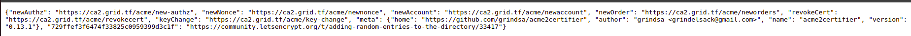

# How to issue a new certificate using the CA

## How to run the CA

### Deploy a VM with a public IP

- whitelist the IP in <https://name.com>

### You need a DNS to serve the CA

- Create a dns record in <https://name.com> with the vm's public IP
- For example, let it be `ca2.grid.tf`

### Installation

In the created vm:

- Clone [acme2cert-exp](https://github.com/abom/acme2cert-exp)

```bash
python3 -m pip install virtualenv --user
python3 -m virtualenv .venv
source .venv/bin/activate
pip install -r requirements.txt
```

- Server is configured by `acme_srv.cfg` configuration file in the [acme](/acme) directory,
before starting, check current example files at [config](/config) directory,
update it with [correct configuration](README.md#configuring-the-server),
then you can copy any of them:

```bash
cp config/acme_srv.zerossl.cfg acme/acme_srv.cfg
```

- Then run this only once:

```bash
python3 django_update.py
```

- Then run:

```bash
source .venv/bin/activate
gunicorn acme2certifier.wsgi --bind 0.0.0.0
```

- The server is running on port 8000. To be able to reach it on `https://ca2.grid.tf`, run:

```bash
caddy reverse-proxy --from ca2.grid.tf --to :8000
```

- Browse `https://ca2.grid.tf`, You should see something like:



Now we have our CA running on `https://ca2.grid.tf` 🎉

## How to issue a certificate using the CA

### The domain

- You need to have a domain with a public IP (deployed on a vm) that is allowed in your configs domains, for example `myvdc.grid.tf`
- You need to have a subdomain with a public IP for the domain , for example `test.myvdc.grid.tf`
- You can use <https://name.com>

### Issue a certificate for the domain `myvdc.grid.tf` using Caddy

Inside your vm:

- Edit or create if not exists a `Caddyfile` with:

```caddy
test.myvdc.grid.tf <an email> {
        tls {
                ca https://ca2.grid.tf
        }
}
```

- Run

```bash
caddy start
```

- You should see in caddy logs `certificate obtained successfully`
- Congrats, You got a certificate now for `test.myvdc.grid.tf` 🎉
